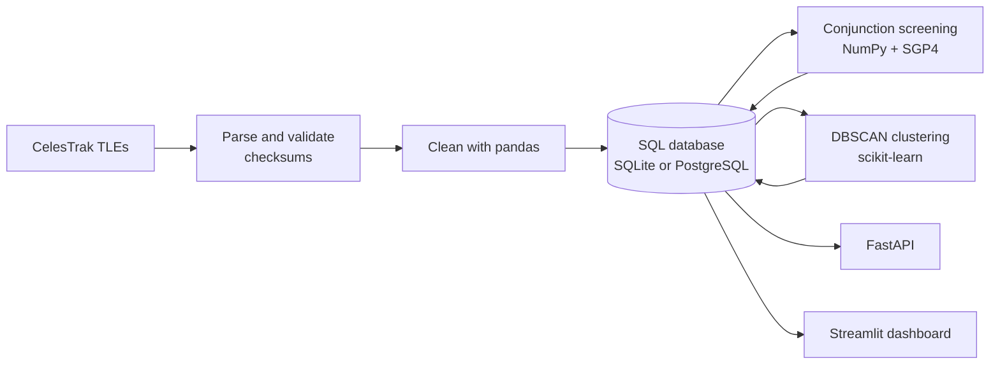
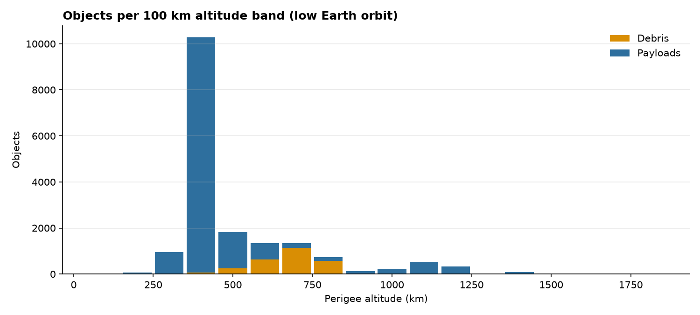
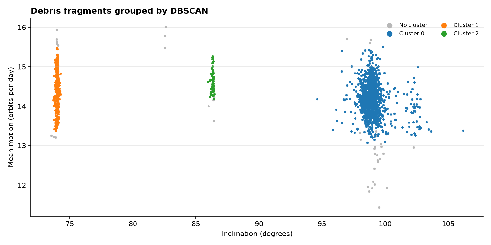

# Space Debris Tracker

Tracks real satellites and debris from [CelesTrak](https://celestrak.org), finds close approaches to a chosen spacecraft (the ISS by default), and uses unsupervised machine learning to rediscover which breakup event each debris fragment came from.


## What it does

| Question | How it's answered |
|---|---|
| What is in orbit, and where is it crowded? | Pipeline loads ~15,000 real TLEs into SQL; views summarise objects by type, orbit regime and altitude band |
| Where is everything right now? | SGP4 propagation, converted to latitude/longitude and shown on a map |
| What will pass close to the ISS in the next 24 hours? | Vectorised conjunction screening with time-of-closest-approach refinement |
| Can we tell which explosion or collision a fragment came from, from its orbit alone? | DBSCAN clustering on orbital elements, scored against the known events |

## Architecture



## Results

<!-- RESULTS:START -->
Latest run: **2026-10-01 06:16 UTC**, using live CelesTrak data. Refreshed automatically every week by GitHub Actions.

| Measure | Value |
|---|---|
| Objects tracked | 18,646 |
| Debris fragments | 2,674 |
| Payloads | 15,967 |
| Rocket bodies | 5 |
| Share in low Earth orbit | 96% |
| ISS close approaches under 10 km (next 24 h) | 1 |
| Closest ISS approach | 9.16 km |



**Breakup events in the catalogue**

| Breakup event | Fragments still tracked | Altitude range (km) | Avg inclination (°) |
|---|---|---|---|
| Fengyun-1C (2007 ASAT test) | 1979 | 305 – 3123 | 98.9 |
| Cosmos 2251 (2009 collision) | 582 | 278 – 1606 | 74.0 |
| Iridium 33 (2009 collision) | 109 | 476 – 1321 | 86.3 |
| Cosmos 1408 (2021 ASAT test) | 3 | 267 – 430 | 82.6 |

**DBSCAN breakup clustering** (the model is never told which event a fragment came from)

| Metric | Value |
|---|---|
| Fragments clustered | 2,673 |
| Clusters found / true events | 3 / 4 |
| Adjusted Rand index (1 = perfect) | 0.96 |
| Homogeneity | 0.98 |
| Completeness | 0.89 |
| Left as noise | 2% |



**Which cluster matched which event**

| True event | cluster 0 | cluster 1 | cluster 2 | noise |
|---|---|---|---|---|
| Cosmos 1408 (2021 ASAT test) | 0 | 0 | 0 | 3 |
| Cosmos 2251 (2009 collision) | 0 | 574 | 0 | 8 |
| Fengyun-1C (2007 ASAT test) | 1949 | 0 | 0 | 30 |
| Iridium 33 (2009 collision) | 0 | 0 | 104 | 5 |

**Closest approaches to the ISS**

| Closest approach | Object | Type | Miss (km) | Rel. speed (km/s) | Risk |
|---|---|---|---|---|---|
| 01 Oct 09:07 UTC | FLOCK 4BE-13 | PAYLOAD | 9.16 | 13.8 | LOW |

Full list: [results/iss_close_approaches.csv](results/iss_close_approaches.csv)
<!-- RESULTS:END -->

## Tech stack

| Area | Tools |
|---|---|
| Language | Python 3.12 |
| Data processing | pandas, NumPy |
| Orbital mechanics | sgp4 |
| Machine learning | scikit-learn (DBSCAN, StandardScaler, NearestNeighbors, clustering metrics) |
| Database | SQL — portable schema and analytics views, SQLite locally, PostgreSQL in Docker |
| API | FastAPI |
| Visualisation | Streamlit, Plotly |
| Packaging and CI | Docker, docker compose, GitHub Actions, pytest |

## Quick start

### Option 1: Docker (everything at once)

```bash
docker compose up --build
```

This starts PostgreSQL, downloads real data and runs the analysis once, then serves:

- Dashboard: http://localhost:8501
- API docs: http://localhost:8000/docs

### Option 2: Run locally with SQLite

```bash
python -m venv .venv
source .venv/bin/activate          # Windows: .venv\Scripts\activate
pip install -r requirements.txt

python -m debris.cli all           # download data, screen the ISS, cluster debris
streamlit run dashboard/app.py     # dashboard
uvicorn api.main:app --reload      # API (separate terminal)
```

### Refresh the results

The **refresh real data** GitHub Actions workflow downloads live CelesTrak data every Monday, runs the full analysis and commits the charts and tables in `results/` plus the Results section above. It can also be started any time from the Actions tab (**Run workflow**). To make the same snapshot locally:

```bash
python -m debris.cli all
python -m debris.report
```

### Command line

```bash
python -m debris.cli ingest                     # download and load (cached for 2 hours)
python -m debris.cli screen --primary 25544     # any NORAD ID; --hours, --threshold (km)
python -m debris.cli cluster                    # --eps, --min-samples
```

## Dashboard

`streamlit run dashboard/app.py` opens five interactive pages:

| Page | What you can do |
|---|---|
| Overview | Rotate and zoom a 3D Earth showing every tracked object, filter by object type and orbit regime; positions update every minute |
| Satellite explorer | Search any object by name or NORAD ID to see its 3D orbit, ground track (map or globe), live altitude and speed, and other objects from the same launch |
| Orbits in motion | Press play to watch hundreds of objects move over the next hours, in 3D or on a map |
| Close approaches | Click an event on the timeline to replay the flyby in the ISS's radial / in-track / cross-track frame, with distance over time |
| Debris clusters | Change DBSCAN's features, `eps` and `min_samples` and watch the clusters, scores and event-vs-cluster heatmap update live |

On first start with an empty database the dashboard downloads live data by itself, so it can be deployed as is on Streamlit Community Cloud.

## API

| Endpoint | Returns |
|---|---|
| `GET /health` | Status and object count |
| `GET /stats/summary` | Counts by type and orbit, breakup-event summary |
| `GET /stats/altitude-density` | Debris and payload counts per 100 km band in LEO |
| `GET /objects` | Filter by `object_type`, `orbit_class`, `search`; paginated |
| `GET /objects/{norad_id}` | Full orbital elements for one object |
| `GET /objects/{norad_id}/position` | Current (or `?at=`) latitude, longitude, altitude and speed |
| `GET /conjunctions` | Close approaches, with `primary` and `max_miss_km` filters |
| `GET /clusters` | Clustering metrics and cluster-vs-event table |

## Method

**Data.** TLEs are downloaded from CelesTrak's active-satellite, space-station and debris groups for four well-known breakups: the 2007 Fengyun-1C anti-satellite test, the 2009 Iridium 33 / Cosmos 2251 collision, and the 2021 Cosmos 1408 anti-satellite test. Every TLE is checksum-validated. Duplicates are removed and re-entering objects (perigee under 100 km) are dropped. Downloads are cached for two hours, following CelesTrak's usage guidance.

**Conjunction screening.** Candidates are first filtered by TLE age (30 days or less) and by altitude overlap with the primary. All remaining objects are propagated together on a 30-second grid with SGP4. Local minima of the distance are refined on a 1-second grid, then corrected with a straight-line relative-motion step to find the time of closest approach. Screening 6,000 objects over 24 hours takes a few seconds.

**Collision probability.** Public TLEs do not include uncertainty (covariance) data, so the probability is an estimate. It assumes a 1 km isotropic position error and a 20 m combined object radius. It is useful for ranking events against each other, not as an operational value.

**Breakup clustering.** Fragments from one breakup start in nearly the same orbit. DBSCAN groups debris using inclination, mean motion and eccentricity (standardised), with `eps` chosen automatically from the k-distance elbow. The true event of each fragment is known from its CelesTrak group, and it is used only to score the result: homogeneity, completeness, adjusted Rand index and silhouette score.

## Limitations

- SGP4 accuracy is a few kilometres at best and degrades as TLEs age. Results are for analysis, not operations.
- Collision probability uses an assumed uncertainty (see above).
- Inclination does most of the work in separating these four events. Events with similar inclinations would be harder to separate.

## Project structure

```
debris/
  config.py          settings (all overridable by environment variables)
  celestrak.py       download with caching
  tle_parser.py      TLE validation, parsing, derived orbit properties
  pipeline.py        download -> parse -> clean -> load
  propagator.py      vectorised SGP4, TEME -> latitude/longitude
  conjunctions.py    close-approach screening
  collision.py       collision probability estimate
  ml/clustering.py   DBSCAN breakup clustering and evaluation
  db.py              database helpers (plain SQL)
  report.py          results snapshot (charts, tables, README section)
  cli.py             command line
sql/schema.sql       tables, indexes and analytics views
api/main.py          FastAPI app
dashboard/app.py     Streamlit dashboard (pages in dashboard/views/)
tests/               pytest suite (synthetic TLEs built with sgp4's exporter)
```

## Tests

```bash
pytest -v
```

The tests use synthetic TLEs generated with `sgp4`'s own exporter, so no network access is needed. They cover TLE parsing, propagation physics (altitude, speed, latitude bounds, sidereal time), conjunction detection, the ingest pipeline, SQL views, clustering quality and every API endpoint. The application itself only loads real CelesTrak data.

## License

MIT
